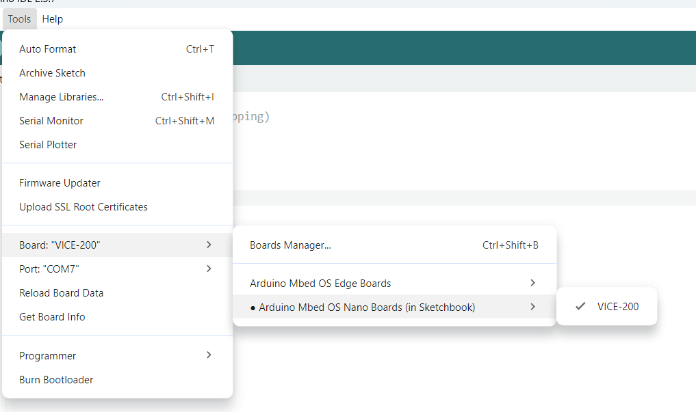

# Arduino_VICE-200

Repository for the **VICE-200** board package (“boardfile”) for use in the **Arduino IDE**.

## Install (Arduino IDE board package)

1. Download / clone this repository.
2. Copy (or drag) the folder **`EOTAK-mbed`** into your Arduino hardware directory:

   - **Windows:** `C:\Users\<YOU>\Documents\Arduino\hardware\`
   - **macOS / Linux:** `~/Documents/Arduino/hardware/`

   After install, you should have a path like:
   `.../Documents/Arduino/hardware/EOTAK-mbed/...`

3. Restart the Arduino IDE.

## Using the VICE-200 board + example sketch

1. In Arduino IDE, select the VICE-200 board from **Tools → Board** (it will appear once the hardware package is installed).
2. Open the example sketch in the example folder:

   - **`blink_Test.ino`**

3. Build and upload as normal.

### Screenshots

**Board Selection in Boards Option:**

**Board Detected Correctly at COM7 under VICE-200:**

## Bootloader firmware

The bootloader hex is included in this repository here:

`EOTAK-mbed\mbed_nano\bootloaders\nano33ble\bootloader.hex`
